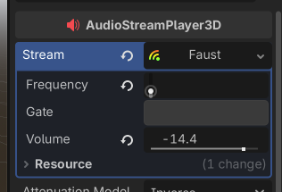
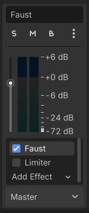
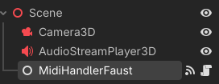

## faust2godot

`faust2godot` is a CLI tool that converts a [Faust](https://faust.grame.fr) written DSP script into a ready-to-use Godot project.
Generated project will only works on the platform where it was compiled from. If you need to open the project again on a different platform
you **must** run that script again on the new platform. 

```
Usage: faust2godot [options] [Faust options] <file.dsp>
Target platform: Linux, MacOSX, Windows
Require: Godot
Generates a ready-to-use Godot engine project.
Options:
   -as-bus-effect : force dsp to be compiled as Godot effect (even though it has no inputs)
   -nvoices <num> : produces a polyphonic DSP with <num> voices, ready to be used with MIDI events
   -effect <effect.dsp> : generates a polyphonic DSP connected to a global output effect, ready to be used with MIDI or OSC
   Faust options : any option (e.g. -vec -vs 8...). See the Faust compiler documentation.
See architecture/unity/README.md for more info.
```

> [!WARNING]
> `Faust2godot` only supports mono and stereo DSP (2 max inputs/outputs).
> Exceeding channels **will be computed** by the DSP, but will not be sent to audio output.

By default, `faust2godot` generates a whole Godot project. **If you wish to use the DSP on an existing project** just copy the
`bin` folder from the directory generated by `faust2godot` into the `res` directory of your existing project. Reopen the project and you should now be
able to use the `AudioStreamFaust` or `AudioEffectFaust`.

---
### Generator DSP

DSP programs without any inputs will be considered as "**Generator DSPs**". 
In Godot, they are compiled into an [AudioStream](https://docs.godotengine.org/fr/4.x/classes/class_audiostream.html)
called `AudioStreamFaust` that can be attached to an [AudioStreamPlayer](https://docs.godotengine.org/en/stable/classes/class_audiostreamplayer.html),
[AudioStreamPlayer3D](https://docs.godotengine.org/en/stable/classes/class_audiostreamplayer3d.html) or [AudioStreamPlayer2D](https://docs.godotengine.org/en/stable/classes/class_audiostreamplayer2d.html).

DSP parameters will be accessible through **resource parameters** or directly through **GDScript** or **C#**.
The `AudioStreamPlayer` must be `playing` in order to have the DSP program working.



>[!NOTE]
>You can put as many `AudioStreamFaust` instances as you want in the scene. They will be separated instances with their own parameters value.
---

### Effect DSP

DSP programs with at least one input will be considered as "**Effect DSPs**".
In the game engine, you will see the DSP as a new [AudioEffect](https://docs.godotengine.org/en/stable/classes/class_audioeffect.html)
that can be attached to as many [Audio Buses](https://docs.godotengine.org/en/stable/tutorials/audio/audio_buses.html) as you want.

To access DSP parameters, just click on the `Faust` effect on the bus, and you should see the parameters on the inspector like a regular godot effect.


> [!INFO]
> You can force a DSP program to be considered as an Effect DSP using the `-as-bus-effect` option when compiling the DSP using 
> the `faust2godot` script. As being an effect, those DSP programs will only work **when audio is entering the bus**.
---
### Polyphonic DSP

**Polyphonic DSPs** are the same as "Generator DSPs". They must be compiled with the `-nvoices` parameter.
**Global effect** (affecting every voices) can also be added using the `-effect` option followed by the path to the effect dsp file.

Polyphonic DSPs are also represented as `AudioStreamFaust` and work the same way as a monophonic DSPs.

### MIDI Compatibility

Godot only supports **MIDI input**. In order to make MIDI inputs working you **must** add the `MidiHandlerFaust` node to the scene.
Just put a single instance anywhere on the scene and you should be able to use MIDI inputs to control the currently running DSP.



If your MIDI controller is detected and ready to use, you should see "Attached to MidiHandler" followed by a **list of detected MIDI devices**
printed in the Godot output when starting the game.
> [!NOTE]
>Adding more than one `MidiHandlerFaust` node **is not necessary**, even if you have multiple DPS instances currently on the scene.

Midi input works with all types of DSP and is **enabled by default** without the need of passing special parameters to the faust2godot script.
**The only rule is to add the `MidiHandlerFaust` node to the scene if you want to be able to control DSP parameters using MIDI inputs.**

The `MidiHandlerFaust` node provide a `midi_received` signal that can be used to know when a MIDI input is received. See the `polyphonic-demo` to view an example 
of how we can leverage this signal to create an interactive instrument using Faust.

## Project architecture

- `architecture` : Contains the `faust2godot` script and the Faust architecture files required.
- `demo` : contains 3 cross-platform demo projects. 
- `documentation` : project documentation.
- `godot-cpp` : godot-cpp sdk (git submodule). Required to compile the host GDExtension.
- `googletest` : unit testing library (git submodule).
- `include` : project includes directory. Contains all header files.
- `src` : project source files.
- `tests` : directory with unit testing environment. For now, the only tests availlable are for dynamic library loading.

## Building project

`faust2godot` use the [CMake](https://cmake.org) project generator.
Building project can take a while due to having to compile godot-cpp sdk. Multithreaded compilation is recommended (`-j nbrThread`).

Building the GDExtension :
```shell
mkdir build && cd build
cmake ..
cmake --build . -j 10
```

Building the GDExtension (with tests) :
```shell
mkdir build && cd build
cmake .. -DBUILD_TESTS=ON
cmake --build . -j 10
```

Run tests :

```shell
cd build
ctest -V
```

